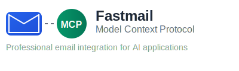

<div align="center">



# Fastmail Model Context Protocol Server

[](https://github.com/doronkatz/Fastmail-MCP/actions/workflows/ci.yml)
[](https://www.python.org/downloads/)
[](https://opensource.org/licenses/MIT)
[](https://modelcontextprotocol.io/)
[](https://github.com/doronkatz/Fastmail-MCP/releases)
[](https://github.com/doronkatz/Fastmail-MCP/actions)

**Professional email integration for AI applications through the Model Context Protocol**

[Quick Start](#quick-start) • [Documentation](#documentation) • [Contributing](#contributing) • [Support](#support)

</div>

---

## 🚀 Quick Start

1. **Clone and install dependencies:**
   ```bash
   git clone https://github.com/doronkatz/Fastmail-MCP.git
   cd Fastmail-MCP
   python -m venv .venv && source .venv/bin/activate
   pip install -r requirements.txt
   ```

2. **Configure your Fastmail credentials:**
   ```bash
   cp .env.example .env
   # Edit .env with your Fastmail app password
   ```

3. **Test the connection:**
   ```bash
   python -m fastmail_mcp.cli verify
   ```

4. **Add to your MCP client** (Claude Desktop, Warp, etc.):
   ```json
   {
     "fastmail": {
       "command": "python3",
       "args": ["-m", "fastmail_mcp.server"],
       "cwd": "/absolute/path/to/Fastmail-MCP",
       "env": {"PYTHONPATH": "/absolute/path/to/Fastmail-MCP/src"}
     }
   }
   ```

## ✨ Features

A powerful Model Context Protocol (MCP) server that provides AI applications with secure access to your Fastmail email, contacts, and calendar data.

### 📧 Email Management
- **Smart Search**: Advanced email search with date ranges, sender filtering, and attachment detection
- **Message Retrieval**: Get full email details including headers, body, and attachments
- **Bulk Operations**: List and filter large email collections efficiently

### 👥 Contact Integration  
- **Address Book Access**: List and search your Fastmail contacts
- **Contact Details**: Retrieve complete contact information
- **Smart Filtering**: Find contacts by name, email, or organization

### 📅 Calendar Events
- **Event Listing**: Access your calendar events and appointments
- **Date-based Queries**: Filter events by specific date ranges
- **Meeting Details**: Get comprehensive event information

### 🛡️ Enterprise-Ready
- **Secure Authentication**: Uses Fastmail app passwords (never your main password)
- **Graceful Fallbacks**: Sample data mode when API is unavailable
- **Comprehensive Logging**: Detailed error reporting and debugging information
- **Production Tested**: Battle-tested with extensive test coverage (80%+)

## 📖 Documentation

### MCP Tools Reference

#### Messages
| Tool | Description | Parameters |
|------|-------------|------------|
| `messages-list` | List recent emails with basic filtering | `limit`, `mailbox` |
| `messages-search` | Advanced search with date/sender/subject filters | `query`, `since`, `before`, `from`, `has_attachment` |
| `messages-get` | Retrieve complete message details | `message_id` |

#### Contacts  
| Tool | Description | Parameters |
|------|-------------|------------|
| `contacts-list` | List contacts from address book | `limit`, `search` |

#### Events
| Tool | Description | Parameters |
|------|-------------|------------|
| `events-list` | List calendar events | `start_date`, `end_date`, `limit` |

### Configuration

#### Environment Variables
Create a `.env` file with your Fastmail credentials:

```bash
# Required: Your Fastmail email address
FASTMAIL_USERNAME=your.email@fastmail.com

# Required: App password (not your main password!)
FASTMAIL_APP_PASSWORD=your-app-password

# Optional: Fastmail API endpoint (defaults to official API)
FASTMAIL_BASE_URL=https://api.fastmail.com

# Optional: Session token for enhanced authentication
FASTMAIL_TOKEN=your-session-token
```

**🔒 Security Best Practices:**
- Never commit your `.env` file to version control
- Use Fastmail app passwords, not your main account password
- Rotate app passwords regularly
- Review the `.env.example` file for reference

#### Creating Fastmail App Passwords

1. Log into your Fastmail account
2. Navigate to **Settings → Privacy & Security → App Passwords**  
3. Click **Create New App Password**
4. Name it "MCP Server" or similar
5. Copy the generated password to your `.env` file
6. Test with: `python -m fastmail_mcp.cli verify`

## 🏗️ Development

### Prerequisites
- **Python 3.11+** (tested on 3.11, 3.12)
- **Git** for version control
- **Fastmail account** with API access

### Development Setup

```bash
# Clone the repository
git clone https://github.com/doronkatz/Fastmail-MCP.git
cd Fastmail-MCP

# Create and activate virtual environment
python -m venv .venv
source .venv/bin/activate  # On Windows: .venv\Scripts\activate

# Install dependencies
pip install -r requirements.txt

# Set up environment
cp .env.example .env
# Edit .env with your credentials
```

### Running the Server

```bash
# Development mode (with debugging)
PYTHONPATH=src python -m fastmail_mcp.server

# Verify connectivity
python -m fastmail_mcp.cli verify
```

### Testing & Quality Assurance

```bash
# Run the complete test suite
pytest

# Run with coverage reporting
pytest --cov=fastmail_mcp --cov-report=term-missing --cov-fail-under=80

# Code formatting
black src tests

# Linting
ruff check src tests

# Fix auto-fixable linting issues
ruff check src tests --fix
```

### Project Architecture

```
Fastmail-MCP/
├── src/fastmail_mcp/           # Main application code
│   ├── client/                 # Fastmail API clients
│   │   ├── api.py             # High-level client interface
│   │   └── transport.py       # JMAP transport layer
│   ├── commands/              # MCP command implementations
│   │   ├── messages.py        # Email operations
│   │   ├── contacts.py        # Contact management
│   │   └── events.py          # Calendar functionality
│   ├── models/                # Data models and schemas
│   ├── schemas/               # Request/response validation
│   ├── server.py              # MCP server implementation
│   ├── cli.py                # Command-line utilities
│   └── utils.py              # Shared utilities
├── tests/                     # Comprehensive test suite
├── assets/                    # Static assets (logos, samples)
├── docs/                      # Additional documentation
├── .github/workflows/         # CI/CD pipelines
└── requirements.txt           # Python dependencies
```

## 🎯 Usage Examples

Once configured with your MCP client, you can interact naturally:

### Email Queries
- *"Show me emails from yesterday"*
- *"Find unread messages from john@company.com"*
- *"List emails with attachments from last week"*
- *"Get the latest email from my manager"*

### Contact Management
- *"Find contacts at Acme Corporation"*
- *"Show me Sarah's contact information"*
- *"List all contacts with phone numbers"*

### Calendar Integration
- *"What meetings do I have today?"*
- *"Show events for next week"*
- *"Find my appointment with Dr. Smith"*

## 🔧 Troubleshooting

### Common Issues

#### Connection Problems
```bash
# Test your credentials
python -m fastmail_mcp.cli verify

# Check server startup
PYTHONPATH=src python -m fastmail_mcp.server --help
```

#### Authentication Failures
- Verify your `.env` file has correct credentials
- Ensure you're using an **app password**, not your main password
- Check that your Fastmail account has API access enabled

#### MCP Client Issues
- Confirm the absolute path in your MCP configuration
- Verify `PYTHONPATH` is set correctly
- Restart your MCP client after configuration changes

### Getting Help

When reporting issues, please include:
- Your operating system and Python version
- MCP client type and version  
- Server logs (with sensitive data removed)
- Steps to reproduce the problem

## 🤝 Contributing

We welcome contributions! This project follows the development guidelines defined in [`AGENTS.md`](AGENTS.md).

### Development Workflow

1. **Fork and Clone**
   ```bash
   git clone https://github.com/yourusername/Fastmail-MCP.git
   ```

2. **Create Feature Branch**
   ```bash
   git checkout -b feature/your-feature-name
   ```

3. **Make Changes**
   - Follow existing code style and patterns
   - Add tests for new functionality
   - Update documentation as needed

4. **Quality Checks**
   ```bash
   # Run the full validation pipeline
   ruff check src tests
   black src tests
   pytest --cov=fastmail_mcp --cov-report=term-missing --cov-fail-under=80
   ```

5. **Submit Pull Request**
   - Use clear, descriptive commit messages
   - Reference any related issues
   - Include tests and documentation updates

### Code Standards
- **Python 3.11+ semantics**
- **Black formatting** (88 character line length)
- **Ruff linting** with project configuration
- **Comprehensive testing** (minimum 80% coverage)
- **Type hints** for public APIs
- **Docstrings** for modules and functions

### Issue Tracking
We use [Linear](https://linear.app/doronkatz) for project management. Issues and feature requests are welcome through GitHub Issues.

## 📋 License

This project is licensed under the MIT License - see the [LICENSE](LICENSE) file for details.

## 🔗 Links

- **Documentation**: [Full Documentation](docs/)
- **Issue Tracker**: [GitHub Issues](https://github.com/doronkatz/Fastmail-MCP/issues)
- **Changelog**: [Release Notes](https://github.com/doronkatz/Fastmail-MCP/releases)
- **MCP Specification**: [Model Context Protocol](https://modelcontextprotocol.io/)
- **Fastmail API**: [Fastmail Developer Docs](https://www.fastmail.com/developer/)

---

<div align="center">

**Made with ❤️ for the MCP community**

[⭐ Star this repo](https://github.com/doronkatz/Fastmail-MCP) • [🐛 Report bugs](https://github.com/doronkatz/Fastmail-MCP/issues) • [💡 Request features](https://github.com/doronkatz/Fastmail-MCP/issues/new)

</div>
