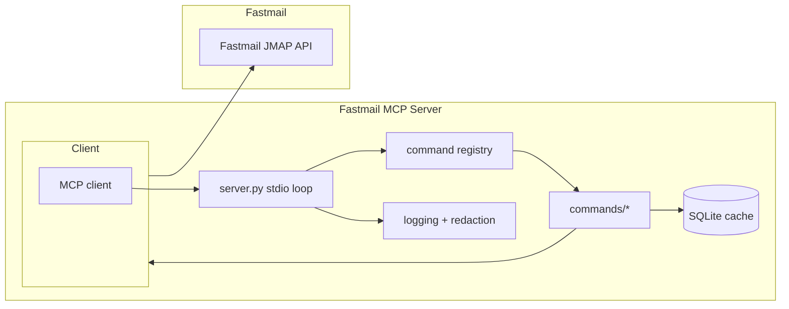

# System Architecture and Deployment Plan (Local/Azure)

## Purpose

Define the end-to-end architecture for the Fastmail MCP server, with a focus on
mail-only workflows. Contacts and calendar remain out of scope until Fastmail
exposes the required JMAP tokens.

## Architecture Overview

The Fastmail MCP server runs as a local-first, single-user tool that exposes an
MCP-compatible stdio (or optional TCP) interface. It translates MCP commands to
Fastmail JMAP API calls, optionally backed by a local cache. The server is
designed to run directly on a developer machine or packaged as a container for
Azure personal deployments.

### Architecture diagram



## Component Responsibilities

- `src/fastmail_mcp/server.py`: MCP stdio loop, request routing, and lifecycle.
- `src/fastmail_mcp/commands/`: Command handlers (messages, mailboxes, etc.).
- `src/fastmail_mcp/client/`: Long-lived JMAP client + transport helpers.
- `src/fastmail_mcp/models/`: Data models for responses and cache mapping.
- `src/fastmail_mcp/utils.py`: Shared helpers (config parsing, redaction).
- `assets/`: Sample payloads for local testing and demos.

## Data Flow (Mail-only)

1. MCP client sends a command over stdio (or TCP in container mode).
2. `server.py` validates the payload and routes to the command registry.
3. The command handler builds a JMAP request using the client layer.
4. The client performs HTTP calls against the Fastmail JMAP endpoint.
5. Responses are mapped into MCP-friendly schemas and returned to the client.
6. Optional: cache write/read paths hydrate summary data for fast listing.

## Runtime Stack and Hosting Assumptions

- Language/runtime: Python 3.11.
- Execution: stdio server for local-first MCP integration.
- Optional TCP bridge for container hosting (`fastmail-mcp-tcp`).
- Local cache (SQLite) for mail listings and mailbox summaries.
- Deployment targets:
  - Local dev host (venv + CLI).
  - Docker container for local or Azure environments.

## Configuration and Secrets

Configuration is environment-variable driven, with `.env` for local use.

Required (local and Azure):
- `FASTMAIL_USERNAME`
- `FASTMAIL_APP_PASSWORD`
- `FASTMAIL_BASE_URL` (defaults to `https://api.fastmail.com`)

Optional:
- `FASTMAIL_SAMPLE_DATA` and related sample overrides for demo mode.
- `FASTMAIL_ENABLE_WRITE_TOOLS=true` to allow send operations.

Secrets handling:
- Never bake credentials into images or git history.
- For local runs, keep `.env` ignored by git.
- For Azure, store secrets in a managed secret store (Azure Container Apps
  secrets, Key Vault) and inject them as environment variables at runtime.
- Log redaction must strip tokens and message bodies before output.

## Observability Strategy

- Use structured logs with request context (command name, duration, status).
- Redact authentication headers and message bodies from logs by default.
- Log levels: INFO for command summaries, DEBUG for sanitized request details.
- Optional error reporting:
  - Send exception summaries to an external sink (Sentry or Azure Monitor)
    without PII.
- Container deployments should forward stdout/stderr to the platform log sink.

## Deployment Options

### Local deployment (venv)

```bash
python -m venv .venv
source .venv/bin/activate
pip install -r requirements.txt
python -m fastmail_mcp.cli verify
python -m fastmail_mcp.server
```

### Local deployment (Docker)

```bash
docker compose build fastmail-mcp
docker compose run --rm -T fastmail-mcp
```

### Azure deployment (container options)

Option A: Azure Container Apps (recommended)
- Build and push the Docker image to a registry (ACR or GitHub Container
  Registry).
- Create a Container App with a single replica and CPU/memory suited for
  background usage.
- Configure secrets and inject environment variables.
- Enable TCP ingress only if you need remote MCP clients.

Option B: Azure Container Instances (simple, single user)
- Create an ACI instance from the Docker image.
- Inject secrets via environment variables at deployment time.
- Use a private VNet or IP filtering if exposing TCP.

## Deployment Checklists

### Local checklist

- [ ] `.env` populated with Fastmail credentials
- [ ] `python -m fastmail_mcp.cli verify` succeeds
- [ ] `python -m fastmail_mcp.server` starts without errors
- [ ] MCP client connects over stdio

### Azure checklist

- [ ] Container image built and pushed to a registry
- [ ] Secrets configured outside the image (Key Vault or platform secrets)
- [ ] Environment variables set for runtime configuration
- [ ] Logs routed to platform logging without sensitive data
- [ ] Network exposure limited to the required client entry point

## Configuration and Logging Strategy Summary

- Configuration comes from env vars (local `.env` or Azure secrets).
- Logging is structured, redacted, and focused on command-level telemetry.
- Errors are captured with minimal context to avoid PII leakage.

## Open Questions

- Should the TCP bridge be enabled by default for Azure deployments?
- Do we want per-command allowlists for Azure-hosted instances?
- Should cache encryption at rest be required for Azure containers?
